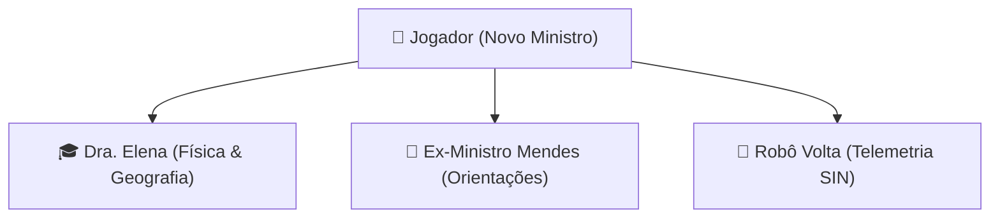

# ⚡ GRID - O Gestor da Rede Elétrica Nacional (2026-2056)

> **Jogo Educativo de Simulação e Governança Energética Interdisciplinar (Física & Geografia)**


---

## 📖 1. A História do Jogo: A Crise do Sistema Elétrico Nacional

### 📜 O Contexto de 2026
No ano de **2026**, o modelo energético global herdado do século XX entrou em colapso definitivo. A extrema dependência internacional de combustíveis fósseis no Hemisfério Norte desencadeou anomalias climáticas severas por todo o planeta. 

No Brasil, os impactos foram devastadores: uma seca histórica e sem precedentes atingiu em cheio as principais bacias hidrográficas das regiões **Sudeste e Centro-Oeste**. A energia potencial gravítica dos reservatórios caiu para alarmantes **14%**, inviabilizando a conversão em energia cinética e elétrica nas grandes turbinas hidrelétricas.

```
       [ Crise Climática Global ]
                   │
                   ▼
     [ Seca nas Bacias Hidrográficas ]
                   │
                   ▼
   [ Reservatórios a 14% de Capacidade ]
                   │
                   ▼
[ Religamento Emergencial de Termelétricas ]
                   │
                   ▼
 [ Tarifa +85% ⚡ | Poluição CO₂ 💨 | Protestos 💥 ]
```

### 📉 O Colapso da Gestão Anterior
Em um movimento desmedido para conter o apagão iminente, o Ministério da Energia ordenou o religamento emergencial de todas as usinas termelétricas a carvão mineral e óleo diesel do país. A conversão de energia química em térmica nestas usinas gerou um custo operacional astronômico com altíssima perda de rendimento por calor.

Em apenas três meses:
* 💸 **Tarifa de energia elétrica subiu 85%**, inviabilizando pequenas indústrias e gerando demissões em massa.
* 🏭 **Emissões de $CO_2$ e poluentes dispararam**, cobrindo grandes metrópoles com fuligem.
* ✊ **O onda de protestos populares** tomou as ruas das principais capitais.

Pressionado e sem soluções sustentáveis, o **Ex-Ministro Mendes** renunciou ao cargo, deixando a matriz elétrica brasileira à beira do colapso estrutural.

---

## 👤 2. O Papel do Jogador e os Personagens

O jogador assume o papel do **Novo Gestor da Rede Elétrica Nacional**, nomeado diretamente pela Presidência da República para governar ao longo de **30 anos (2026 a 2056)**.



### 👥 Personagens Principais
* **Dra. Elena (Membro Sênior / Física Teórica)**: Mentora acadêmica que apresenta os dilemas científicos, calculando o impacto de conceitos como Efeito Joule ($P = R \cdot I^2$), conversões energéticas e dinâmica de bacias hidrográficas.
* **Ex-Ministro Mendes (Ex-Ministro da Energia)**: O gestor deposto que introduz o jogador ao painel de controle durante o tutorial de posse, alertando sobre as armadilhas econômicas e sociais da governança.
* **Robô Volta (Assistente de Automação SIN)**: Módulo inteligente de monitoramento em tempo real que reporta dados da rede interligada e alertas de emergência.

---

## 📊 3. Indicadores de Governança e Condições do Jogo

O jogador deve manter o equilíbrio síncrono de 4 pilares estratégicos (medidos de 0% a 100%):

| Indicador | Símbolo | Descrição |
| :--- | :---: | :--- |
| **Economia** | $\$$ | Recursos financeiros públicos para novos investimentos, manutenção e subsídios. |
| **Sociedade** | $\heartsuit$ | Satisfação da população em relação a tarifas, oferta de empregos e segurança de suprimento. |
| **Meio Ambiente** | $\mathrm{Tree}$ | Preservação dos ecossistemas, redução de emissões de $CO_2/CH_4$ e proteção da biodiversidade. |
| **Estabilidade da Rede** | $\text{Zap}$ | Capacidade da infraestrutura do Sistema Interligado Nacional (SIN) de atender à demanda sem apagões. |

### 🚨 Condições de Vitória e Derrota
* **🏆 Vitória (Ano 2056)**: Chegar ao final de 30 anos mantendo todos os 4 indicadores ativos e alcançando pelo menos **50% de redução nas emissões de $CO_2$** em relação a 2026.
* **☠️ Colapso Imediato**: Se **qualquer um dos 4 indicadores atingir 0%**, o sistema nacional desmorona e o jogo encerra com um relatório específico de crise.
* **🔴 Modo Crítico (< 20%)**: Se algum indicador cair abaixo de 20%, a sala de controle entra automaticamente em iluminação emergencial vermelha e ativa o **Efeito Dominó** de crises imprevisíveis.

---

## 📚 4. Fundamentos Científicos Interdisciplinares

### 🔬 Conceitos de Física Aplicada
* **Conservação e Transformação de Energia**: $E_p = m \cdot g \cdot h \rightarrow E_k = \frac{m \cdot v^2}{2} \rightarrow E_e$ nas turbinas hidrelétricas.
* **Perda por Efeito Joule na Transmissão**: $P = R \cdot I^2$ — Dissipação de energia em forma de calor nas linhas de alta tensão de longa distância.
* **Efeito Fotovoltaico**: Conversão direta de fótons de radiação solar em corrente elétrica contínua nos painéis de silício.
* **Termodinâmica e Rendimento**: Limite de eficiência real do ciclo de vapor nas usinas termelétricas e nucleares.

### 🌍 Conceitos de Geografia Aplicada
* **Climatologia e Bacias Hidrográficas**: Vazão de rios de planalto vs. planície e sensibilidade a eventos extremos (*El Niño* e *La Niña*).
* **Impactos Socioambientais na Amazônia**: Alagamento de florestas tropicais, decomposição orgânica emitindo Metano ($CH_4$) e deslocamento de populações ribeirinhas/indígenas.
* **Geopolítica dos Combustíveis Fósseis**: Dependência de cotações internacionais e vulnerabilidade da matriz nacional.
* **Geração Distribuída**: Desafios espaciais e territoriais da intermitência de ventos e radiação solar.

---

## 🛠️ 5. Tecnologias Utilizadas

* **HTML5 Semântico**: Estruturação modular da tela de título, cinemática RPG e HUD de controle.
* **CSS3 Moderno**: Design System Dark Glassmorphic 16-bit com filtros CRT scanlines e paletas HSL.
* **JavaScript (Vanilla ES6)**: Motor do jogo, máquina de estados, sistema de diálogos *typewriter* e cálculo síncrono dos indicadores.
* **Chart.js**: Renderização dinâmica da matriz energética em tempo real.

---


---

*Desenvolvido como projeto escolar educativo integrando os currículos de Física e Geografia.*
